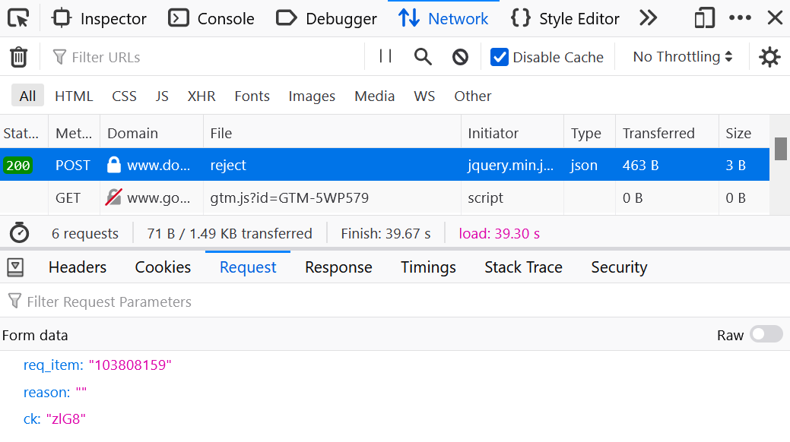
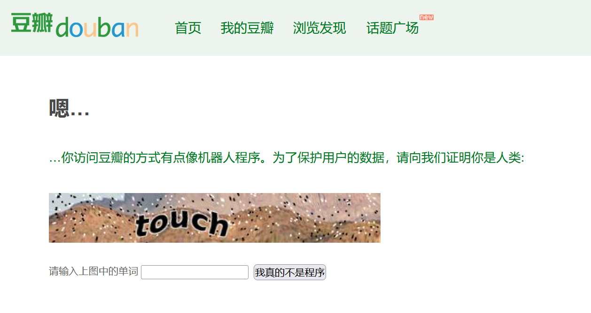

# 豆瓣小组搬家自动审核
对于每个入组申请，在旧小组的成员列表搜索是否有申请的这位用户，有的话通过，没有的话拒绝。

相对于手动审核的优点：
1. 快，一个人一天处理几万个申请完全没有问题
2. 自动化，只需要每隔一段时间输入验证码即可
3. 很多人开通了豆瓣新的隐藏主页的功能，根本没有办法按照传统的方法检查用户主页的小组和自证截图，只能在旧小组的成员列表搜索

## 使用方法

### 安装需要的packages
`pip install -r requirements.txt`

### 在config.py里填入需要设置的值
  - old_group_id：旧组的ID
  - new_group_id: 新组的ID
  - douban_cookie和security_token：
    1. 在新组的申请加入列表页面，手动检查第一个人应该通过还是拒绝
    2. `Ctrl+Shift+I` 打开developer tools，选中Network tab
    3. 通过或者拒绝第一个人，这时Network里会显示一个新的HTTP POST，选中
    4. 点Headers，在Request Headers里找到Cookie，复制Cookie的值填入douban_cookie
    5. 点Request，把ck的值填入security_token。以下图为例，ck是 `zlG8`
    

### 运行程序 
- `python3 autoaccept.py START_NUM`
- 从命令行传入参数，设置从入组申请的哪一页开始倒序处理
- 网页版入组申请一页有50个，所以`START_NUM` 必须是50的倍数
- 假设现在一共有1178个入组申请，如果想从最早的申请开始处理的话，那么最早的一页就是第1150-1178个申请，所以START_NUM = 1150。在terminal里输入 `python3 autoreject.py 1150`，程序就会开始运行，从第1150个申请所在那页开始检查，直到最新的一个申请

### 验证码
- 豆瓣的反爬虫机制如果检测出操作异常的话，会禁止访问，要求输入验证码
- 大约每处理500个申请就会出现禁止访问，这时候程序会暂停，并且提示你需要人工用浏览器打开任意一个豆瓣页面并且输入验证码后，在terminal输入回车才能继续审核

- 因此虽然程序是自动审核，但仍然需要时不时看看terminal，检查一下是不是又应该输入验证码了